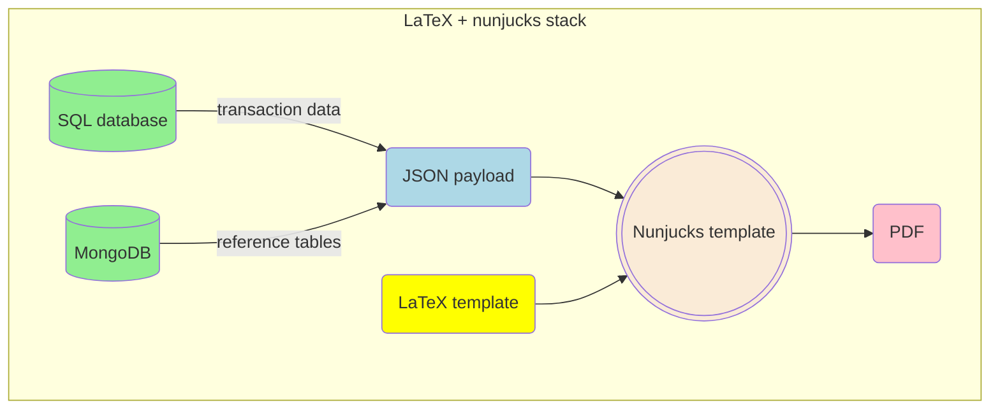

## 1. Install LaTeX compiler
For Ubuntu, execute the two lines of code:
<pre class="command-line"><code>sudo apt install texlive-full</code></pre>
The texlive-full installation should have included lualatex compiler, which offers more advanced features such as emoji.

## 2. Create and configure a project
1. Create a project with directories
   ```
   Project
   |
   |
   |---client
   |
   |
   |---server
       |
	   |
	   |---src (TypeScript source code .mts)
	   |
	   |
	   |---dist (compiled JavaScript .mjs)
	   |
	   |
	   |---views (LaTeX template)
	   |
	   |
	   |---pdf (PDF for development review)
   ```
2. Install npm packages (plus type declarations as needed) on the server side
   - express, cors, cookie-parser, dotenv, mongodb, mongoose, sequelize, tedious, etc.
   - child_process, fs-extra, string-to-stream, temp, through2

3. Write source code for printing LaTeX to PDF (server/src/app-data/app-tools/node-latex.mts)
   - Check out <mark>latex-node</mark> npm package. Source code below were rewritten based off it.
   - <mark>lualatex</mark> compiler is used as it provides more advanced features.

	```typescript
	'use strict'

	import strToStream from 'string-to-stream';
	import child_process from 'child_process';
	const spawn = child_process.spawn;
	import through from 'through2';
	import fse from 'fs-extra';
	import temp_module from 'temp';
	const temp = temp_module.track();
	import path from 'path';
	import fs from 'fs';

	/**
	* Generates a PDF stream from a LaTeX document.
	*

	* @param {String} src - The LaTeX document.
	* @param {Object} options - Optional compilation specifications.
	* @return {DestroyableTransform}
	*/

	function latex(src: any, options: any = null) {

	const outputStream: any = through()

	/**
	* Emits the given error to the returned output stream.
	*/
	const handleErrors = (err: any) => {
		outputStream.emit('error', err)
		outputStream.destroy()
	}

	/**
	* Emits errors from logs to output stream, and also gives full log to user if requested.
	*/

	const printErrors = (tempPath: any, userLogPath: any) => {
		const errorLogPath = path.join(tempPath, 'texput.log')
		fs.stat(errorLogPath, (err, stats) => {
		if (err || !stats.isFile()) {
			outputStream.emit('error', new Error('No error log file.'))
			return
		}

		const errorLogStream = fs.createReadStream(errorLogPath)
		if (userLogPath) {
			const userLogStream = fs.createWriteStream(path.resolve(userLogPath))
			errorLogStream.pipe(userLogStream)
			userLogStream.on('error', (userLogStreamErr) => handleErrors(userLogStreamErr))
		}
		const errors: any = []
		errorLogStream.on('data', (data) => {
			const lines = data.toString().split('\n')
			lines.forEach((line, i) => {
			if (line.startsWith('! Undefined control sequence.')) {
				errors.push(lines[i - 1])
				errors.push(lines[i])
				errors.push(lines[i + 1])
			} else if (line.startsWith('!')) {

				errors.push(line)
			}
			})
		})

		errorLogStream.on('end', () => {
			const errMessage = `LaTeX Syntax Error\n${errors.join('\n')}`
			const error = new Error(errMessage)
			outputStream.emit('error', error)
		})
		})
	}

	temp.mkdir('node-latex', (err, tempPath) => {
		if (err) {
		handleErrors(err)
		}

		let inputStream
		if (!src) {
		handleErrors(new Error('Error: No TeX document provided.'))
		}

		if (typeof src === 'string') {
		inputStream = strToStream(src)
		} else if (src.pipe) {
		inputStream = src

		} else {
		handleErrors(new Error('Error: Invalid TeX document.'))
		}

		options = options || {}

		function resolvePaths(paths: any) {
		if (Array.isArray(paths)) {
			return paths.map(pth => path.resolve(pth))
		}

		return path.resolve(paths)
		}

		// The path(s) to your TEXINPUTS.
		const inputs = options.inputs ? resolvePaths(options.inputs) : tempPath
		// The path(s) to your font inputs for fontspec.
		
		const fonts = options.fonts ? resolvePaths(options.fonts) : tempPath

		// The binary command to run (`pdflatex`, `xetex`, etc).
		// const cmd = options.cmd || 'pdflatex'
		const cmd = options.cmd || 'lualatex'

		// The number of times to run LaTeX.
		const passes = options.passes || 1

		// The path to where the user wants to save the error log file to.
		const userLogPath = options.errorLogs

		// The path(s) to your precompiled files.
		const precompiled = options.precompiled ? resolvePaths(options.precompiled) : null

		const copyPrecompiled = (pathToPrecompiled: any) => {
		fs.readdirSync(pathToPrecompiled).forEach(file =>
			fs.copyFileSync(path.resolve(pathToPrecompiled, file), path.resolve(tempPath, file))
		)
		}

		// The current amount of times LaTeX has run so far.
		let completedPasses = 0

		if (passes > 1 && typeof src !== 'string') {
		const msg = 'Error: You can\'t process a stream twice. Pass a string to use multiple passes.'
		handleErrors(new Error(msg))
		return
		}

		/**
		* Combines all paths into a single PATH to be added to process.env.
		*/
		const joinPaths = (inputs: any) =>
		(Array.isArray(inputs) ? inputs.join(path.delimiter) : inputs) +
		path.delimiter

		const args = options.args || [
		'-halt-on-error'
		]

		args.push('-jobname=texput')
		const opts = {
		cwd: tempPath,
		env: Object.assign({}, process.env, {
			TEXINPUTS: joinPaths(inputs),
			TTFONTS: joinPaths(fonts),
			OPENTYPEFONTS: joinPaths(fonts)
		})
		}

		/**
		* Runs a LaTeX child process on the document stream
		* and then decides whether it needs to do it again.
		*/
		const runLatex = (inputStream: any) => {
		const tex = spawn(cmd, args, opts)

		inputStream.pipe(tex.stdin)

		// Prevent Node from crashing on compilation error.
		tex.stdin.on('error', handleErrors)

		tex.on('error', () => {
			handleErrors(new Error(`Error: Unable to run ${cmd} command.`))
		})

		tex.stdout.on('data', (data) => { });
		tex.stderr.on('data', (data) => { });
		tex.on('close', (code) => { });
		tex.on('exit', (code) => {
			
			if (code !== 0) {
			printErrors(tempPath, userLogPath)
			return
			}

			completedPasses++
			// Schedule another run if necessary.

			completedPasses >= passes
			? returnDocument()
			: runLatex(strToStream(src))
		})
		}

		/**
		* Returns the PDF stream after the final run.
		*/
		const returnDocument = () => {
		const pdfPath = path.join(tempPath, 'texput.pdf')
		const pdfStream = fs.createReadStream(pdfPath)
		pdfStream.pipe(outputStream)
		pdfStream.on('close', () => fse.removeSync(tempPath))
		pdfStream.on('error', handleErrors)
		}

		// Start the first run.
		if (precompiled) {
		Array.isArray(precompiled) ? precompiled.forEach(copyPrecompiled) : copyPrecompiled(precompiled)
		}
		runLatex(inputStream)
	})

	return outputStream
	}

	export default latex;
	```
   
4. Configure Node.js project in package.json and tsconfig.json. This applies to any TypeScript back end.
   - package.json
   ```json
   "build": "tsc",
   "start": "node dist/app.mjs",
   "dev": "npx tsc -w & nodemon dist/app.mjs",
   ```
   - tsconfig.json
   ```json
   "compilerOptions": {
	"target": "ES2022",
	"module": "NodeNext",
	"moduleResolution": "NodeNext",
	"sourceMap": true,   // for debugging
	"outDir": "dist",
   },
   "include": ["src/**/*"]
   ```