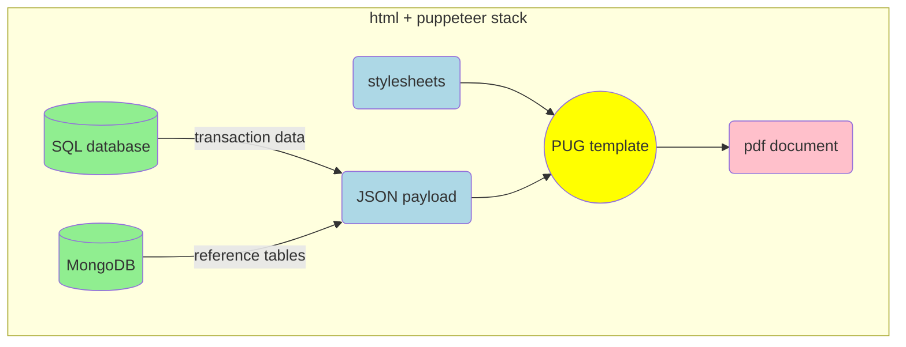

## 1. Set up project
1. Create a TypeScript project on the back end. Feel free to check out documentation at /back-end/typescript-ESM 
2. Install pug, puppeteer, and packages for accessing databases (mongodb, mongoose, sequelize, tedious, etc.)
3. Install sass compiler and type declaration as development dependencies (sass, @types/pug, @types/puppeteer, @types/sequelize)
4. Create directories for pug templates and html outputs; create directories for stylesheets and images under /public (in order for your HTML page to access them). Use a folder structure that is intuitive.

## 2. Configure package.json
```json
  "scripts": {
    "build": "npx tsc",
    "start": "node dist/app.mjs",
    "dev": "npx sass -w public/scss:public/css & npx pug -w ./views -o ./views/html -P & npx tsc -w & nodemon dist/app.mjs"
  },
```

When executing 'npm run dev', 3 things happen":
- <mark>npx sass -w public/scss:public/css</mark>: any change in .scss will trigger sass to recompile into .css
- <mark>npx pug -w ./views -o ./views/html -P</mark>: any change in .pug template will trigger pug to recompile into .html
- <mark>npx tsc -w & nodemon dist/app.mjs</mark>: any change in .mts source code will trigger TypeScript compiler to compile into .mjs

## 3. Create .pug templates and reusable components; styles and images (if applicable)
- Stylesheets (.scss and compiled .css) and images need to live under directory /public to be accessible.
- Create resuable pug templates and stylesheets to simplify project maintenance. For example, a header with Hanover logo. (Stylesheets, images and templates can also be shared across different projects. For example, a lobster boat PDF file and a COP PDF file can share the same header template with Hanover logo. You only need to inject different texts.)

## 4. Write code (sequelize query, MongoDB query) to retrieve data from database
- Make sure primary key is also returned from database&mdash;we will use it as a unique identifier (a URL parameter) when building routes.

## 5. Build TypeScript classes with getters to calculate values to be injected into pug templates
- If you already have TypeScript code calculating these values on the front end, copy them to back end. The pdf generator project is set up using TypeScript.

## 6. Inject data into a pug template and create a route to serve the rendered HTML page
```typescript
app.get('/pdf-doc', (req, res) => {
	res.render('pdf-doc', data);
});
```

## 7. Print the served HTML page to PDF
- Make sure that your function is called asynchoronously. Many users may use the pdf generator at the same time. We do not want one task to block another.
```typescript
// print to PDF
async function printToPDF() {
	try {
		// create a browser instance
		const browser = await puppeteer.launch();

		// create a new page
		const page = await browser.newPage();

		// URL to export as PDF
		const url = 'http://localhost:4466/pdf-doc';

		// In production, we need to create a MongDB document and use its ID as file name, saving metadata with the PDF file
		await page.goto(url, {waitUntil: 'networkidle0'});
		const pdf = await page.pdf({
			path: 'YOUR_FILE_PATH/result.pdf',
			format: 'A4'
		});

		await browser.close();
	} catch (e) {
		 console.log(e);
	}
}
```

