# Transactions

## 1 Why do we need transactions?

[Sequelize transactions](https://www.google.com)

If a database operations screws up, bad data (stub) may end up in the database. We need a strategy to back out.

```mermaid
flowchart LR

classDef database color: white, fill: navy
classDef backend color: white, fill: darkred

A((("NodeJS 🕥"))):::backend -.-> |"saving metadata 💣"| B[(MongoDB)]:::database
A --> C[(SQL)]:::database

```



We need use this syntax 👍 💩
```typescript
	let x = 5;
	console.log(x);

```