<style>
	table, th, td {
		border: 1px solid black;
        text-align: left;
	}

	table {
		border-collapse: collapse;;
	}

	.darkgreen {
		color: darkgreen;
	}

	th, td {
		padding: 10px;
		width: 80px;
	}

	.navy {
		background-color: navy;
		color: white;
		font-weight: bold;
	}

	.purple {
		color: purple;
	}

	.darkred {
		background-color: darkred;
		color: white;
		font-weight: bold;
	}

	.link {
		cursor: pointer;
		text-decoration: none;
		font-weight: bold;
	}
</style>

The official [rxjs guide](https://rxjs.dev/guide/observable) gives an excellent introduction to observables. Under 'Anatomy of an Observable' section are the following words:
> *Observables are created using new Observable or a creation operator, are subscribed to with an Observer, execute to deliver next/error/complete notifications to the Observer, and their execution may be disposed.*
___

### 1.1 Functions, iterators, promises and observables
Let's use real-life analogies to illustrate these concepts.
When my family visited Iceland last summer, we had different meals. 
- At the Glacial National Park, we stopped at a food truck for lunch, where 🐟 and 🍟 were ordered and served right away. 
- At the Great Geyser, we had lunch at a food court, where we ordered lamb 🐑 with other food items. A chef in full uniform prepared the food and served everything in one go. 
- Later that day, we had dinner at a hotel's full-service restaurant 🍴. Our order consisted of multiple items: beverages, appetizers, main courses and disserts, which were served over time.

Now let's compare the meals. 
<table>
    <tr>
        <th>Service</th>
        <th>Time</th>
        <th>Item Bundle</th>
        <th>Arrival Time</th>
        <th>Analogy</th>
    </tr>
    <tr>
        <td>Food Truck</td>
        <td>Instant</td>
        <td>One</td>
        <td>One</td>
        <td>Function</td>
    </tr>
    <tr>
        <td>Food Court</td>
        <td>Wait</td>
        <td>One</td>
        <td>One</td>
        <td>Promise</td>
    </tr>
    <tr>
        <td>Restaurant</td>
        <td>Wait</td>
        <td>Multiple</td>
        <td>Multiple</td>
        <td>Observable</td>
    </tr>
</table>

___

### 1.2 Asynchronous architecture in JavaScript
Like food preparation in a restaurant, a lot of tasks take time 🕥 to complete in the computer world. For example:
- File upload takes time due to network speed and writing to hard drive.
- Most API calls takes time. 
    - Internet traffic takes time.
    - An API may perform database operations.
- Some of Angular's [custom input validators](## "As of Angular 16, all Angular's built-in form validators are synchronous, i.e. instantaneous.") take time to execute. Examples are:
    - After a user enters an ID in a form field, Angular makes an API call to check whether that ID exists in a database. 
    - City and ZIP code autofill/validation 🌍 takes time. Angular makes API calls to check:
         - If a city exists for a given state
         - If a ZIP code exists for that city.

A synchronous architecture, where the execution of each operation happens sequentially, is not efficient at handling such operations, as synchronous is a blocking architecture. Let's again use another analogy to illustrate the idea.

A waitress 👧 works at a full-service restaurant 🍴. 
- Under a synchronous architecture:

```mermaid
flowchart LR
Order1("👨 Customer 1 places order") --> TakeOrder("👧 Waitress takes order") 
TakeOrder --> AcceptOrder("👩‍🍳 Kitchen accepts order")
AcceptOrder -.-> |"🧑‍🍳"| PrepareFood("👩‍🍳 Chef prepares food")
PrepareFood --> AcceptFood("👧 Waitress accepts food")
AcceptFood --> ServeFood("👨 Waitress serves food")
ServeFood --> Order2("👩 Customer 2 places order")
```

- Under an asynchronous architecture:

```mermaid
flowchart LR
Order1("👨 Customer 1 places order") --> TakeOrder("👧 Waitress takes order") 
TakeOrder --> AcceptOrder("👩‍🍳 Kitchen accepts order")
AcceptOrder --> TakeOrder2("👩 Customer 2 places order")
TakeOrder2 --> AcceptOrder2("👩‍🍳 Kitchen accepts order")
AcceptOrder -.-> |"🧑‍🍳"| PrepareFood("👩‍🍳 Chef prepares food")
AcceptOrder2 -.-> |"🧑‍🍳"| PrepareFood2("👩‍🍳 Chef prepares food")
PrepareFood --> AcceptFood("👧 Waitress accepts food")
AcceptFood --> ServeFood("👨 Waitress serves food")
```


An asynchronous architecture is vastly superior 👍 to a synchronous one in this scenario. Instead of idling at customer 1's table, the waitress can take orders from customer 2, customer 3... while food is being prepared for customer 1.

> *Asynchronous is a non-blocking architecture, so the execution of one task isn't dependent on another. Tasks can run simultaneously.*
___

### 1.3 Observable &amp; rxjs library
Promises and observables help us work with asynchronous functionalities. A promise emits a single event; an observable does everything a promise does, plus a lot more. It can emit 0, 1 or any number of events either synchronously, asynchronously, or a mix of the two. 
- Observable is our new standard for handling asynchoronous functionalities in JavaScript. 
- JavaScript rxjs library provides tools to work with observables.

A lot of things are better demonstrated than explained. Below are a few code examples:
```typescript
// A synchronous observable emitting 4 values. 
const obs$ = of(1, 2, 3, 4);
obs$.subscribe( data => {
    console.log( data ** 2);
});
// output: 1, 4, 9, 16
```
A few observations:
- An observable can emit a sequence of values. In this example, 4 values are emitted.
- To invoke an observable and see its values, an observable needs to be subscribed. 
- A subscriber is a callback function that is invoked once for each emitted value.