> 
Asynchronous is a non-blocking architecture, so the execution of one task isn't dependent on another. Tasks can run simultaneously.

___

A lot of tasks take time 🕥 to complete in the computer world. For example:
- File upload takes time due to network speed and writing to hard drive.
- Most API calls takes time. 
    - Internet traffic takes time.
    - An API may perform database operations.
- Some of Angular's [custom input validators](## "As of Angular 16, all Angular's built-in form validators are synchronous, i.e. instantaneous.") take time to execute. Examples are:
    - After a user enters an ID in a form field, Angular makes an API call to check whether that ID exists in a database. 
    - City and ZIP code autofill/validation 🌍 takes time. Angular makes API calls to check:
         - If a city exists for a given state
         - If a ZIP code exists for that city.

A synchronous architecture, where the execution of each operation happens sequentially, is not efficient at handling such operations, as synchronous is a blocking architecture. Let's use an analogy in real life to illustrate this concept.

A waitress 👧 works at a full-service restaurant 🍴. 
- Under a synchronous architecture:

```mermaid
flowchart LR
Order1("👨 Customer 1 places order") --> TakeOrder("👧 Waitress takes order") 
TakeOrder --> AcceptOrder("👩‍🍳 Kitchen accepts order")
AcceptOrder -.-> |"🧑‍🍳"| PrepareFood("👩‍🍳 Chef prepares food")
PrepareFood --> AcceptFood("👧 Waitress accepts food")
AcceptFood --> ServeFood("👨 Waitress serves food")
ServeFood --> Order2("👩 Customer 2 places order")
```

- Under an asynchronous architecture:

```mermaid
flowchart LR
Order1("👨 Customer 1 places order") --> TakeOrder("👧 Waitress takes order") 
TakeOrder --> AcceptOrder("👩‍🍳 Kitchen accepts order")
AcceptOrder --> TakeOrder2("👩 Customer 2 places order")
TakeOrder2 --> AcceptOrder2("👩‍🍳 Kitchen accepts order")
AcceptOrder -.-> |"🧑‍🍳"| PrepareFood("👩‍🍳 Chef prepares food")
AcceptOrder2 -.-> |"🧑‍🍳"| PrepareFood2("👩‍🍳 Chef prepares food")
PrepareFood --> AcceptFood("👧 Waitress accepts food")
AcceptFood --> ServeFood("👨 Waitress serves food")
```

An asynchronous architecture is vastly superior 👍 to a synchronous one in this scenario. Instead of idling at customer 1's table, the waitress can take orders from customer 2, customer 3... while food is being prepared for customer 1. This is how a restaurant operates in real life.

