# Asynchronous calls 

> *Asynchronous is a non-blocking architecture, so the execution of one task isn't dependent on another. Tasks can run simultaneously.*
___

A lot of tasks take time to complete. For example:

- File upload
- API calls
- An Angular async pipe, which fetches data from a remote source for display
- A Reactive Form async validator, which fetches data from a remote source for input validation

JavaScript is single-threaded. If these tasks are executed synchronously (sequentially), your app will stall. With asynchronous architecture, tasks are executed concurrently. When a task completes, a callback function is invoked.

Let's use an analogy in real life to illustrate this concept.

A waitress 👧 works at a full-service restaurant.

- Synchronous:

```mermaid
flowchart LR
Order1("👨 Customer 1 places order") --> TakeOrder("👧 Waitress takes order") 
TakeOrder --> AcceptOrder("👩‍🍳 Kitchen accepts order")
AcceptOrder -.-> |"🧑‍🍳"| PrepareFood("👩‍🍳 Chef prepares food")
PrepareFood --> AcceptFood("👧 Waitress accepts food")
AcceptFood --> ServeFood("👨 Waitress serves food")
ServeFood --> Order2("👩 Customer 2 places order")
```

- Asynchronous:

```mermaid
flowchart LR
Order1("👨 Customer 1 places order") --> TakeOrder("👧 Waitress takes order") 
TakeOrder --> AcceptOrder("👩‍🍳 Kitchen accepts order")
AcceptOrder --> TakeOrder2("👩 Customer 2 places order")
TakeOrder2 --> AcceptOrder2("👩‍🍳 Kitchen accepts order")
AcceptOrder -.-> |"🧑‍🍳"| PrepareFood("👩‍🍳 Chef prepares food")
AcceptOrder2 -.-> |"🧑‍🍳"| PrepareFood2("👩‍🍳 Chef prepares food")
PrepareFood --> AcceptFood("👧 Waitress accepts food")
AcceptFood --> ServeFood("👨 Waitress serves food")
```

Instead of idling at customer 1's table, the waitress can take orders from customer 2, customer 3... while food is being prepared for customer 1. When food is ready, she serves to food to the correct customer (via a callback function). This is how a real-life restaurant operates.
