# Asynchronous calls

### 1. Async calls

> *Asynchronous is a non-blocking architecture, so the execution of one task isn't dependent on another. Tasks can run simultaneously.*
___

A lot of tasks take time to complete. For example:

- File upload
- API calls
- An Angular async pipe, which fetches data from a remote source for display
- A Reactive Form async validator, which fetches data from a remote source for input validation

JavaScript is single-threaded. If these tasks are executed synchronously (sequentially), your app will stall. With asynchronous architecture, tasks are executed concurrently. When a task completes, a callback function is invoked.

Let's use an analogy in real life to illustrate this concept.

A waitress 👧 works at a full-service restaurant.

- Synchronous:

```mermaid
flowchart LR
Order1("👨 Customer 1 places order") --> TakeOrder("👧 Waitress takes order") 
TakeOrder --> AcceptOrder("👩‍🍳 Kitchen accepts order")
AcceptOrder -.-> |"🧑‍🍳"| PrepareFood("👩‍🍳 Chef prepares food")
PrepareFood --> AcceptFood("👧 Waitress accepts food")
AcceptFood --> ServeFood("👨 Waitress serves food")
ServeFood --> Order2("👩 Customer 2 places order")
```

- Asynchronous:

```mermaid
flowchart LR
Order1("👨 Customer 1 places order") --> TakeOrder("👧 Waitress takes order") 
TakeOrder --> AcceptOrder("👩‍🍳 Kitchen accepts order")
AcceptOrder --> TakeOrder2("👩 Customer 2 places order")
TakeOrder2 --> AcceptOrder2("👩‍🍳 Kitchen accepts order")
AcceptOrder -.-> |"🧑‍🍳"| PrepareFood("👩‍🍳 Chef prepares food")
AcceptOrder2 -.-> |"🧑‍🍳"| PrepareFood2("👩‍🍳 Chef prepares food")
PrepareFood --> AcceptFood("👧 Waitress accepts food")
AcceptFood --> ServeFood("👨 Waitress serves food")
```

Instead of idling at customer 1's table, the waitress can take orders from customer 2, customer 3... while food is being prepared for customer 1. When food is ready, she serves to food to the correct customer (via a callback function). This is how a real-life restaurant operates.

Async calls add another dimension to your code: time. By the time an async all returns, the state of your program will have changed. As a developer, <mark>you need to coordiante various data streams from different async calls based on their interdependency</mark>. For example, in an office reservation app, you have an 'edit reservation' function, where an existing reservation needs to be removed from the database before a new reservation can be added. A cancellation call needs to return before a creation call is invoked. This is achieved using mergerMap() operator in the rxjs library. *Operators manipulating higher order observables (observables that return observables) are among the most difficult topics of the rxjs library*.

It should be noted that <mark>familiar control flow structures (e.g. for loop, while loop) are not async aware</mark>&mdash;they're oblivious of wait time or latency between iterations.

### 2. Advantages of Observables + rxjs over vanilla callbacks and Promises

Though callback functions and Promises are still used for simple async operations, in Angular we will use almost exclusively Observables because of the advantages they offer, which include:

- Clean syntax (no callback hell)
- Can handle multiple values
- Can cancel a subscription
- Can retry from failure

The rxjs library combines functional and reactive programming paradigms. It offers many useful operators for working with observables, which help a developer to abstract away the notion of latency from his/her code while allowing the modeling of solutions using a linear sequence of steps through which data can flow over time.
