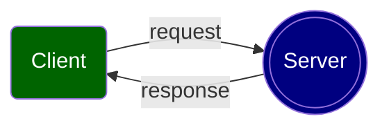
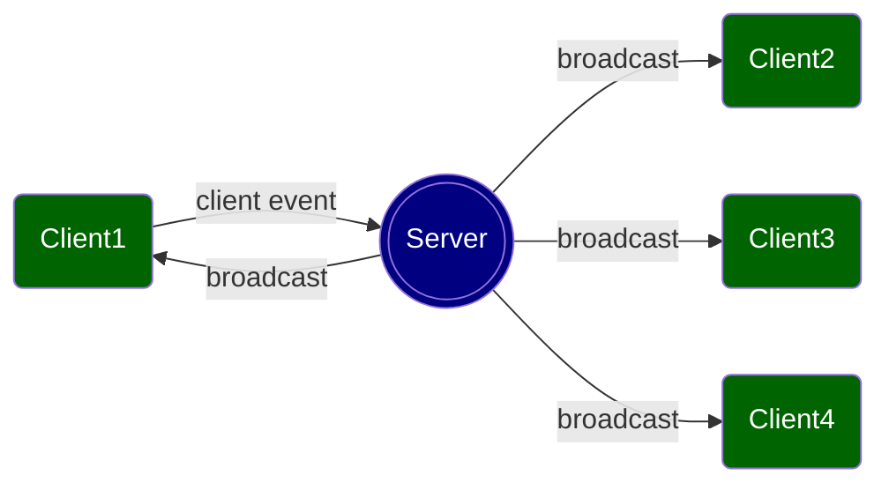

# 1. Introduction

## 1.1 HTTP vs. WebSocket

Though both the HTTP protocol and the WebSocket protocol allow two-way communication between a server and a client, they are different:

- An HTTP connection uses half-duplex communication: a client sends a request and a server responds to that request. Only one party can communicate at a time and the server's message is always in response to a request from a client.

- A Websocket connection uses full-duplex communication: either side of the connection can send messages whenever they want.

## 1.2 The Socket.IO library

Socket.IO is a JavaScript library that provides an abstraction layer on top of WebSocket, making it easier to create real-time applications.
- socket.io: installed on server side (Node.js)
<pre><code class='command-line'>npm install socket.io</code></pre>
- socket.io-client: installed on client side (Angular)
<pre><code class='command-line'>npm install socket.io-client</code></pre>
