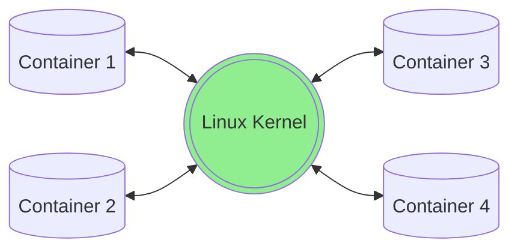
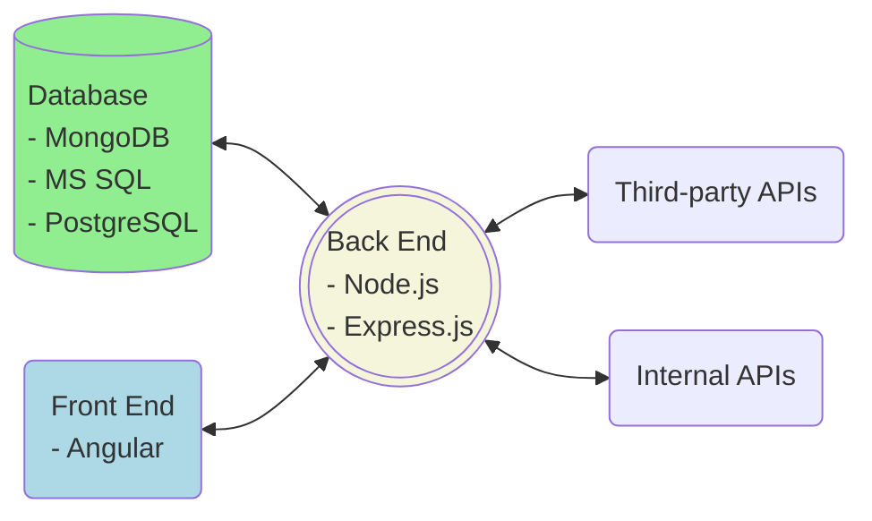

# Deploy an App in Azure Cloud
A CI/CD pipeline is the preferred deployment approach, as it allows deployment from source code. The approach described below requires building a docker image. When activated, a docker image turns into a docker container which serves a web app.

---
### Overview of Docker Deployment
A Node.js app runs in an isolated docker environment with all its dependencies (except operating system kernel) installed inside a container environment. All docker containers run off a shared Linux kernel from the hosting environment. 

Each docker container has its own Node.js back end and compiled Angular front end served by the back end.

We recommend Alpine Linux with preinstalled Node.js as our base image. For example, for Node.js 18, use
<pre><code>FROM node:18-alpine</code></pre> in your docker file. Alpine Linux is parsimonious, resulting in greatly reduced image size (~ 150MB vs. 1GB+ using Ubuntu image).

A web app has 3 parts:
- Front end (Angular app): Source code are compiled into a folder served by the back end (e.g. /server/dist/). These compiled code run in a browser (e.g. Google Chrome) on the client side.
- Back end (Node.js app): Source code run on a server. It serves APIs (e.g. database CRUD operations) and the compiled front end.
- Database: For data persistency, a SQL database (e.g. Microsoft SQL) and/or a no-SQL database (e.g. MongoDB) are used to store data.

___

### Set up App Service and Networking in Azure
The following steps highlight setting up your App Service and networking for both Azure and Hanover, to connect the App Service to URL (<i>PROJECT_NAME.allmerica.com)</i>

1. Create Azure App Service
	- Basics
		- Project Details: Choose Subscription (ex: Commercial Lines - R&D) and Resource Group (eg: EnterpriseSolutions)
		- Instance Details: Under Publish, choose Docker Container, Linux as OS, and East US 2 for Region.
		- App Service Plan: Choose relevant App Service Plan (eg: CLDevAppService)
					
	- Docker
		- Options: Choose Single container, and Azure Container Registry for Image Source
		- Azure container registry options: Choose the docker registry, image, and tag from the previous step (this can be changed/updated later)  
			Monitoring (optional)  
			Enable Application insights can be enabled for better debugging

	Click *Review and Create*  
	Once created, navigate to the Overview tab and add tags for BusinessUnit, CostCenter (345078), Department (Analytics), and Environment

2. Setup Networking (Internal - Azure)
  - Create Azure Private Endpoint
    - Open App Service and Navigate to *Networking*
    - Under *Inbound Traffic*, Click into Private Endpoints, then Add
    - Name your Endpoint, and select the same Subscription as above (ex: Commercial Lines - R&D)
    - Select Virtual Network (ex: CL-RD-EastUS2-vnet) and Subnet (ex: trusted subnet 2)
    - <mark>Make sure that "Integrate with private DNS Zone" is set to No</mark>
  	Click **Ok**. After creating, navigate to the Private Endpoint Overview, and verify the ResourceGroup is "NetworkServices"

	- Setup Vnet Integration
    - Return to App Service and Navigate to *Networking*
    - Under *Outbound Traffic*, Click into Vnet Inegration, then Add
    - Select the same Virtual Network as the Private Endpoint (CL-RD-EastUS2-vnet)
    - Select Existing Subnet, and choose one of the subnets listed under Available for Integration (trusted-subnet-1)
    - Click **Ok**

  - Submit Request for Private Endpoint Integration with Azure's Core DNS
    - Return to App Service and navigate to *Networking*
  	- Copy the Private Endpoint Name and Inbound IP address from the *Inbound Traffic* section
    - Return to the *Overview* page, and copy the Subscription Name and Subscription ID
    - Go to the Technology Place and submit an "Other Request" at the bottom
    - Submit a Request Ticket with the information collected, and save the REQ#
    Please link our “APP_SERVICE_NAME” Web App with the private endpoint “PRIVATE_ENDPOINT_NAME” to Azure core DNS: 
	<pre><code>App Service Name: facreinsurance-dev
    Private Endpoint Name: facreinsurance-dev
    Subscription: Commercial Lines - R&D (da6c049b-87cd-4e56-b023-fd0b825d8c35)
    Inbound IP Address: 10.93.3.37</code></pre>

	- Finally, send an email to Janar *(jperumalsam@hanover.com)* with the REQ# and let him know the same info

3. Setup Networking (External - Hanover)
  - Submit Custom Domain Request
    - Return to App Service, and navigate to *Custom Domains*
    - Copy the Custom Domain Verification ID
    - Navigate to [netpub](http://netpub/netpub-cgi/ipmr.pl), list your email and select FreeForm for Function
    - Leave the other fields blank, and under Comment section submit this information:
    <pre><code> External DNS Change.

		TXT asuid.APP_SERVICE_DOMAIN_NAME.allmerica.com    CUSTOM_DOMAIN_VERIFICATION_ID
		CNAME APP_SERVICE_DOMAIN_NAME.allmerica.com     APP_SERVICE_DOMAIN_NAME.azurewebsites.net

		Internal DNS

		A record
		APP_SERVICE_DOMAIN_NAME.allmerica.com 

		INBOUND_IP_ADDRESS
		</code></pre>

    *Note: Requests are processed on Thursdays, and the SLA is 5 business days, so make sure to give plenty lead time*  
            
	- Setup Custom Domain in App Service
    - When the request is completed, return to App Service and navigate to *Custom Domains*
    - Click Add Custom Domain, enter the App Service Domain Name, and verify Hostname Record Type is CNAME
    - Click Validate, and when validation passes, click **Ok**
            
  - You should be all set! If you run into issues, try the following:
    - Restart the App Service
    - If you or a business user gets the error message from F5 - **"Access to this page is blocked. Access was denied by a per-request policy."**, you'll need to request to be added to the LDAP group
		<pre><code>EV/UAT: cn=CAAMSTest,ou=GROUPS,ou=RISK,o=ALLMERICA 
		ROD: cn=CAAMSPROD,ou=GROUPS,ou=RISK,o=ALLMERICA</code></pre>
___

### Deploy App
1. Create your Dockerfile at your project root. A sample dockerfile is shown below. 
- You need to replace XX with the correct node.js version, e.g. 16
- If you may debug the app in production using Angular Dev Tools in your Chrome browser, replace --production with --development (I suppose your development configuration has sourceMap = true).

	<pre><code># build front end
	FROM node:XX AS client_build
	WORKDIR /app
	COPY ./client /app/
	RUN npm install --force
	RUN node_modules/.bin/ng build -c=development

	# build back end
	FROM node:XX AS server_build
	WORKDIR /app
	COPY ./server /app/
	COPY --from=client_build /app/dist/client /app/dist
	RUN npm install --production

	# build docker
	FROM node:XX-alpine
	WORKDIR /app
	COPY --from=server_build /app ./
	CMD ["node", "./bin/www"]
	</code></pre>
	<mark>Remember to create your own .env file since .env is ignored by git to protect password.</mark>
2. Check project configuration
	- Make sure the output path in file src/angular.json is correct, i.e. the front end is compiled into a directory that is to be copied to the back end
	- Make sure your environment (development, UAT, production) are configured correctly (e.g. using the correct baseUrl's from their corresponding app services)
3. Build docker image and push to Azure Container Registry (ACR)
	1. Under your deployment root directory, execute: 
		<pre class="command-line"><code>
		az login --use-device-code
		sudo az acr login --name AZURE_DOCKER_REGISTRY --subscription SUBSCRIPTION_ID 
		sudo docker build -t YOUR_CONTAINER_REGISTRY.azurecr.io/APP_NAME:TAG_NAME . && sudo docker push YOUR_CONTAINER_REGISTRY.azurecr.io/APP_NAME:TAG_NAME
		</code></pre>
		Subscription ID can be found in Azure portal.  
		**Note:** Make sure the "YOUR_CONTAINTER_REGISTRY" is in all lower case. If this includes upper case letters, you will get an "unauthorized error". For example, if the container registry is named PWBContainerReg, the following command will be: *sudo docker build -t pwbcontainerreg.azurecr.io/APP_NAME:TAG_NAME*
		<mark>**pwbcontainerreg** is our current ACR for test deployment.</mark>

	2. Log into Azure portal, select the correct app service, and then click on 'Deployment Center' on left. Select the correct image you just created and save ('Save' button on upper left). Once saving is finished, go back to the overview section of your app service and click on "Restart".