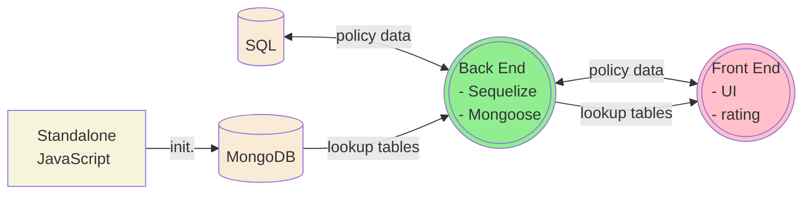

# Applications with Actuarial Rating



- Policy data
	- Use SQL database to house policy data (data engineers are most SQL experts unfamiliar with MongoDB queries).
	- Build CRUD operations for policy data (use sequelize as much as you can, as sequelize is database-agnostic)
	___
- Rating lookup tables
	- Use MongoDB database to house actuarial lookup tables.
	- Define nested Mongoose schemas under <mark>/server/mongodb_models/</mark> for the rating tables. Nested schemas facilitate easy multi-value lookup.

	```typescript
	// child schemas definition
	const BasicMajorLossLoadSchema = new mongoose.Schema({
		jurisdiction: String,
		classificationGroup: String,
		coverage: String,
		ratingValue: Number
	});
	
	// more child schemas defined here ...

	// master schema
	const COP_RaterSchema = new mongoose.Schema({
		// date range
		modelEffectiveDate: Date,
		modelExpirationDate: Date,

		// lookup tables
		basicMajorLossLoadTable: [BasicMajorLossLoadSchema],
		// more child schemas...
	}, { collection: 'cop_raters' });
	```
	- Whenever a new rating plan is implemented, create a new MongoDB document to house a new set of lookup tables.
	- Each MongoDB rating document should have a model effective date and a model expiration date.
	- Use a standalone JavaScript file to initialize a MongoDB document. (These files, though live under <mark>/server/rating_table_initialization/</mark>, are not part of the back end. You can use another language such as Python to create MongoDB documents.)
	___
- Rate calculation 
	- Implement rate calculation on the front end (often with nested classes and getters for improved code readability).
	- Retrieve the correct rating plan (a document of lookup tables) from MongoDB based on policy effective date (model effective date &leq; policy effective date &leq; model expiration date).
	```typescript
	export class CopRater {
		constructor() {}  // reactive form, services facilitating rate calculation and services for APIs (to get rating tables from a MongoDB database)

		// rate calculation
		get additionalCoverageSum() {
			let additionCoverages = this.copForm.get('AdditionalCoverages').value;
			let sum = additionCoverages.reduce((a: number, b: number) => { return a + Number(b['premiumAmount']); }, 0);
			return sum;
		}
		// more rate calculation...
	}
	```
