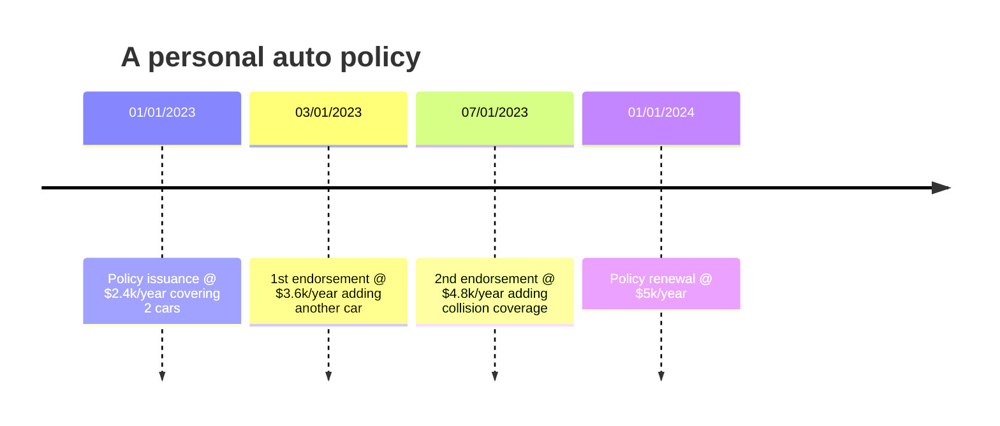
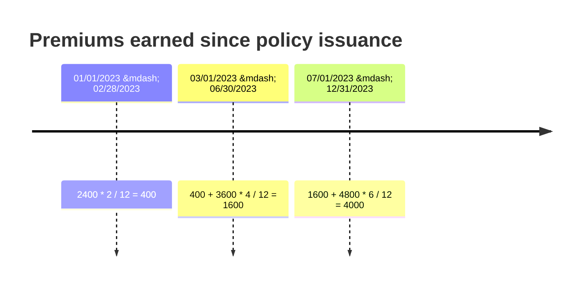

>An endorsement is an ammendment to an existing insurance contract that changes the terms of the original policy. An endorsement can be issued at the time of purchase, mid-term or at renewal time. Insurance premiums are often affected and adjusted as a result.

Often, our business partners need to:

- view a policy's history: issuance, endorsement(s), renewal
- compare premiums and coverages between two snapshots

