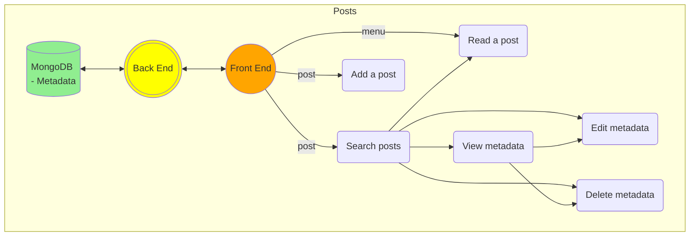

# Developer resources 
Git repo: <mark>git@ssh.dev.azure.com:v3/HanoverSolutionsDevelopers/Solutions%20Developers/techdoc</mark>

## 1. Why Markdown + MongoDB?
- Rich text with visualization, source code syntax highlighting, math formulas, etc.
- Easy to build and update.
- Easy to search.

## 2. What is a Post?
A post is written in markdown and often uses plugins to improve readability. Below is a list of markdown plugins:
- <mark>mermaid</mark> for charting
- <mark>prismjs</mark> for source code syntax highlighting
- <mark>katex</mark> for complex math formulas

A post lives under <mark>/client/src/assets/markdown/</mark> and is rendered by a component.

## 3. Post metadata 
A post has the following metadata saved in a MongoDB database:
- title
- authors
- keywords
- description
- url

A user can search for posts by the metadata fields above.

## 4. App flowchart
