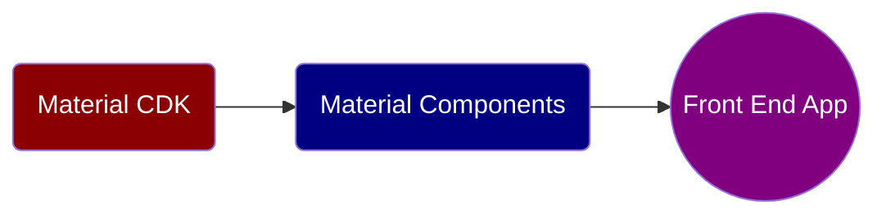

## Angular Material CDK
Angular Material library's Component Development Kit (CDK) is a set of behavior primitives for building UI components. PortalModule and OverlayModule from Angular Material CDK can be used to create rich HTML mouse-over tips.

```typescript
import { PortalModule } from '@angular/cdk/portal';
import { OverlayModule } from '@angular/cdk/overlay';
```

