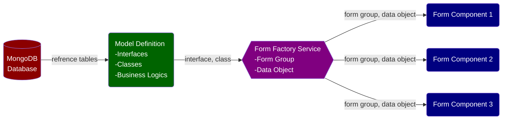

___

## 1 Introduction

We often have Reactive Forms in an Angular app with calculated values derived from form data and reference tables.

- A user may enter/edit data in a form group. Form data may also be populated from database/API calls.
- Calculated values are rendered in UI.
- User changes to a form (e.g. selecting a different value from a dropdown list) are reflected in UI.
- Calculation often requires metadata (e.g. lookup tables).



___

## 2 Interface and Class Definition

Defining data structure should always come first.

```typescript
import { FormControl, FormGroup, FormArray, Validators } from "@angular/forms";

export interface IPlayer {
    playerName: string | null,
    salary: number | null
}

// A wrapper class allows convenient access and manipulation of form controls and easy implementation of business logics
export class Player implements IPlayer {

    constructor(
        public playerForm: FormGroup
    ) { }

    get playerName(): string | null {
        return this.playerForm.controls['playerName'].value;
    }

    get salary(): number | null {
        return this.playerForm.controls['salary'].value;
    }

    set playerName(v: string | null) {
        this.playerForm.controls['playerName'].setValue(v);
    }

    set salary(v: number | null) {
        this.playerForm.controls['salary'].setValue(v);
    }

}

export interface ITeam {
    teamName: string | null,
    managerName: string | null,
    players: Player[] | null
}

export class Team implements ITeam {
    constructor(
        public teamForm: FormGroup
    ) { }

    get teamName(): string | null {
        return this.teamForm.controls['teamName'].value;
    }

    get managerName(): string | null {
        return this.teamForm.controls['managerName'].value;
    }

    get playerFormArray(): FormArray | null {
        return <FormArray>this.teamForm.controls['players'];
    }

    get playerSalary(): number[] | null {
        return this.playerFormArray.controls.map(x => Number(x.get('salary').value));
    }

    get totalPlayerSalary(): number {
        return this.playerSalary.reduce( (a, b) => a + b ); 
    }

    get players(){
        return this.playerFormArray.value;
    }

    set teamName(v: string | null) {
        this.teamForm.controls['teamName'].setValue(v);
    }

    set managerName(v: string | null) {
        this.teamForm.controls['managerName'].setValue(v);
    }

    set players(p: Player[] | null) {
        this.teamForm.controls['players'] = null;

        if (p?.length > 0) {
            p.forEach(x => {
                (<FormArray>this.teamForm.controls['players']).controls.push(
                    new FormGroup({
                        playerName: new FormControl(x.playerName, Validators.required),
                        salary: new FormControl(x.salary, Validators.required)
                    })
                );
            });
        }
    }

}
```

___

## 3 Component

```typescript
import { Component } from '@angular/core';
import { FormFactoryService } from '../services/form-factory.service';

@Component({
  selector: 'app-calculated-fields',
  templateUrl: './calculated-fields.component.html',
  styleUrls: ['./calculated-fields.component.scss']
})
export class CalculatedFieldsComponent {

  intakeForm = this.formFactory.teamForm;
  team = this.formFactory.team;

  constructor(
    private formFactory: FormFactoryService
  ) {}

  onSubmit() {
    console.log('%c 👍 Form data are sent to the back end.', 'color: green');
  }

}
```

___


## 4 Template

```html

<form [formGroup]="intakeForm" (ngSubmit)="onSubmit()">
    <app-input label="Team Name" [control]="$any(intakeForm.controls['teamName'])" matTooltip="We are a group of lynx."></app-input> &nbsp; 
    <app-input label="Manager Name" [control]="$any(intakeForm.controls['managerName'])"></app-input> <br>

    <div>Players</div>
    <div formArrayName="players">
        <div *ngFor="let p of $any(intakeForm.controls['players']).controls; let i = index"
            [formGroupName]="i"
        >
            <app-input fmt="currency" label="Player Name" [control]="$any(p.controls['playerName'])"></app-input> &nbsp;
            <app-input fmt="currency" label="Salary" [control]="$any(p.controls['salary'])"></app-input> <br>
        </div>
    </div>

    <div>Total player salary: {{ team.totalPlayerSalary|  currency: 'USD': 'symbol': '1.0-0' }}</div>
    <br>

    <button mat-mini-fab type="submit"><mat-icon>done</mat-icon></button>
</form>

```