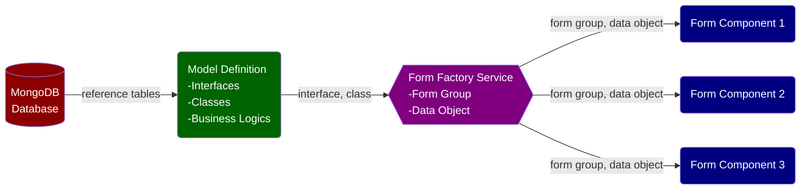

We often need to perform calculations and implement business logics using data saved in a Reactive Form. The following design pattern is recommended:

 

- A master Reactive Form, which often comprises of hierarchic child forms, are defined in a Form Factory Service and injected into various components for consumption. For example:
  - At the top level, there is an insurance policy with policy-level attributes such as policy number, customer number, policy effective date, etc.
  - Under a policy, there are multiple coverages such as property, general liability, etc., each with their own coverage-specific data fields.
  - Under property coverage, there are multiple locations with location-level attributes such as city, state, etc.
  - Under a location, there are multiple buildings with building-level attributes such as construction type, year built, etc.

- The master Reactive Form is consumed by multiple components and their children, each rendering a part of the form in the UI. For example:
  - A property component renders an array of location child components.
  - An auto component renders an array of vechile child components.
- The Form Factory Service &rarr; Components setup ensures two things:
  - The underlying Reactive Form remains intact even after a component is destroyed on navigating away, because the form is provided by the Form Factory Service.
  - All components share the same underlying master Reactive Form. **Changes effected on the master Reactive Form by one component is reflected in all components**.
- A user can enter/edit data in the form. Form data can also be populated/changed by an API call to a database or an API call to a 3rd party vendor.
- Calculations/business logics are implemented via a wrapper class, where getters, setters and class methods are defined to manipulate/consume Reactive Form data, calculate values, and implement business logics.
  - UI-related Reactive Form artifacts are abstracted away, so a developer can work on the underlying data structure directly.
  - Code implementing calculation and business logics are greatly simplified. A developer no longer needs to deal with bloated syntax accessing Reactive Form data or typecast Abstract Controls.
  - Data type conversion can also be performed in a getter or setter. For example, a Reactive Form field for dollar value stores a string value such as '$10,000'. With type conversions from string to number implemented in a getter and a setter, a wrapper class can directly perform math operations on a dollar field.
- Changes to a calculated field are reflected in the UI in real time. For example, the moment a user picks a different construction type from a dropdown menu, property premium will update to reflect this change.
- Calculation and data transformation require reference data (e.g. lookup tables) loaded from a database (often MongoDB).
