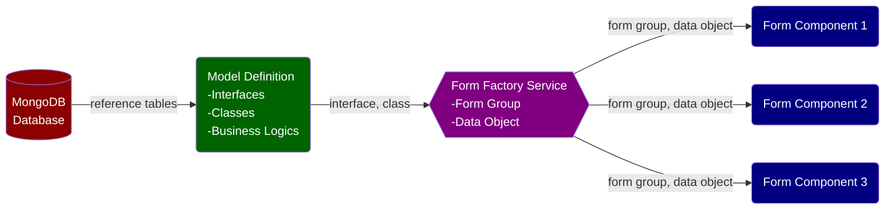

We often need to perform calculations and implement business logics using data saved in a Reactive Form. The following design pattern is recommended:

- A master reactive form, which often comprises of hierarchic child forms, are defined in a Form Factory Service and injected into various components for consumption. For example:
  - At the top level, there is an insurance policy with policy-level attributes such as policy number, customer number, policy effective date, etc.
  - Under a policy, there are multiple coverages such as property, general liability, etc., each with their own coverage-specific data fields.
  - Under property coverage, there are multiple locations with location-level attributes such as city, state, etc.
  - Under a location, there are multiple buildings with building-level attributes such as construction type, year built, etc.


- The master reactive form is consumed by multiple components and their children, each rendering a part of the form in the UI. For example:
  - A property component renders an array of location child components.
  - An auto component renders an array of vechile child components.
- The Form Factory Service &rarr; Components setup ensures two things:
  - The underlying Reactive Form remains intact even after a component is destroyed on navigating away, because the form is provided by the Form Factory Service.
  - All components share the same underlying master Reactive Form. *Changes effected on the master Reactive Form by one component is reflected in all components*.
- A user can enter/edit data in the form. Form data can also be populated/changed by an API call to a database or a 3rd party vendor.
- Calculations/business logics are implemented using a wrapper class; calculated/transformed values are displayed in the UI.
- Changes to a form are reflected in the UI in real time.
- Calculation and data transformation require reference data (e.g. lookup tables) loaded from a database (e.g. MongoDB).




___

## 3 Component

```typescript
import { Component } from '@angular/core';
import { FormFactoryService } from '../services/form-factory.service';

@Component({
  selector: 'app-calculated-fields',
  templateUrl: './calculated-fields.component.html',
  styleUrls: ['./calculated-fields.component.scss']
})
export class CalculatedFieldsComponent {

  intakeForm = this.formFactory.teamForm;
  team = this.formFactory.team;

  constructor(
    private formFactory: FormFactoryService
  ) {}

  onSubmit() {
    console.log('%c 👍 Form data are sent to the back end.', 'color: green');
  }

}
```

___


## 4 Template

```html

<form [formGroup]="intakeForm" (ngSubmit)="onSubmit()">
    <app-input label="Team Name" [control]="$any(intakeForm.controls['teamName'])" matTooltip="We are a group of lynx."></app-input> &nbsp; 
    <app-input label="Manager Name" [control]="$any(intakeForm.controls['managerName'])"></app-input> <br>

    <div>Players</div>
    <div formArrayName="players">
        <div *ngFor="let p of $any(intakeForm.controls['players']).controls; let i = index"
            [formGroupName]="i"
        >
            <app-input fmt="currency" label="Player Name" [control]="$any(p.controls['playerName'])"></app-input> &nbsp;
            <app-input fmt="currency" label="Salary" [control]="$any(p.controls['salary'])"></app-input> <br>
        </div>
    </div>

    <div>Total player salary: {{ team.totalPlayerSalary|  currency: 'USD': 'symbol': '1.0-0' }}</div>
    <br>

    <button mat-mini-fab type="submit"><mat-icon>done</mat-icon></button>
</form>

```