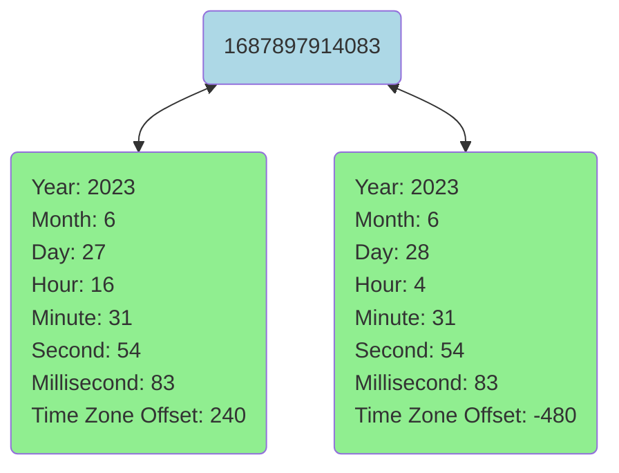

## 1. JavaScript Date
A JavaScript Date object represents a single moment in time measured as milliseconds since the epoch, or midnight of 01/01/1970, UTC time. It is obvious that a JavaScripte Date lives in a one-dimensional Euclidean space, where any moment in time can be represented by an integer. You can get that integer by calling getTime() method on a Date object.  (A computer is a finite-state machine and cannot represent time with infinite granularity&mdash;hence the millisecond/integer representation instead of real number.)

## 2. Calendar Date
To a human, however, things are more complicated. There are several concepts: 
- year: any integer
- month: {0, 1, 2, ..., 11} (JavaScript month starts with 0)
- day: {1, 2, 3, ... 31}
- hour: {0, 1, 2, ... 23}
- minute: {0, 1, 2, ..., 59}
- second: {0, 1, 2, ..., 59}
- millisecond: {0, 1, 2, ..., 999}
- time zone offset: {-720, -660, -600, ..., +840} (time zones span -12&ndash;+14, and hence time zone offsets span -720&ndash;+840)
To determine a unique moment in time, we need all 8 elements above. 

Hence we have 2 systems representing time:
- Computer 💻 time: a one-dimensional Euclidean space where a moment in time is represented as an integer.
- Calendar 📆 time: an eight-dimensional space where a moment in time is represented as a vector of 8 values.

## 3. Mapping between JavaScript Date and Calendar Date is 1-to-26
Mapping between a computer time (integer) and a calendar time (8-tuple) is 1-to-26, as there are 26 different time zones 🌍. (A pacific island country created addtional time zones to avoid being split by the international date line. Hence we have 26 time zones instead of 24.) 

Chart below illustrates the idea, where time 1687897914083 (milliseconds since the epoch) is mapped to both ET (Eastern Time) and CST (China Standard Time).

(There is also daylight saving to make things even more confusing, but let's ignore that.)

## 4. JavaScript gets timezone from your computer
If a JavaScripte Date maps to 26 different calendar times, how does a computer display a single calendar date based on a JavaScripte Date object? The answer: it uses your computer's time zone. As suggested by the chart above, computer time 1687897914083 is displayed as 4:31PM, 06/27/2023 if you are in Boston, but 4:31AM, 06/28/2023 if you are in Beijing. Please note that the days differ: 6/27 vs. 6/28. 

Now you probably have guessed: a displayed date in JavaScript is off by one day because of time zone difference.
