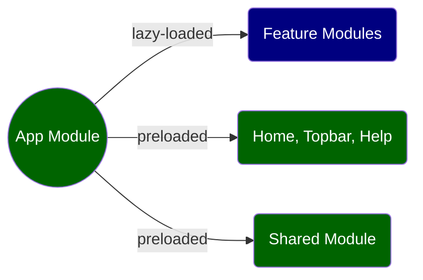

# Lazy-loaded modules

## 1. Why lazy-load feature modules?

An Angular app should preload only the bare minimum that allows it to become responsive. All other functions (often implemented in various feature modules) should be lazy-loaded&mdash;they are loaded in the background while the app is already served. Lazy-loading should be adopted ubiquitously for all feature modules as it offers superior user experience&mdash;our app becomes responsive instantaneously with 0 delay.

When a user accesses our Angular app, often only 3 components and 1 module (in addition to the App module) need to be preloaded:

- Three components (housed under the app module)

	- Topbar: this component displays app title, menu button plus a few other buttons for quick access/navigation.
	- Homepage: this page often displays a welcome message and some UI artifacts, e.g. an input box for policy number.
	- Help: this page often displays the email address of the developer. It does not need to be preloaded but given its tiny size, it is not worth the overhead of creating a separate lazy-loaded module for the help page, and preloading it will have almost no impact on app responsiveness.

- Shared module

	- Exports Angular material modules and Angular utility modules to be consumed by other modules, e.g. dropdown menu, radio button, HttpClient.
	- Exports a few homemade components such as a spinner component, custom input components, etc.

## 2. CLI commands for creating module-specific components and feature modules

Starting with Angular 17, a component is standalone by default&mdash;a standalone component does not belong to any module and can be consumed by whoever imports it. Often we need to create module-specific components that are not shared. This will require option *--standalone=false* in your Angular CLI command.

- To create a preloaded component under the app module
<pre class="command-line"><code>ng g c components/COMPONENT_NAME --standalone=false --module=app</code></pre>
As mentioned above, under the app module, there should be only 3 preloaded components: home, help and top-bar. By convention, we place them under /src/app/components/.

- To create a component under a feature module, use
<pre class="command-line"><code>ng g c modules/MODULE_NAME/COMPONENT_NAME --standalone=false --module=MODULE_NAME</code></pre>

- To create a lazy-loaded feature module, use
<pre class="command-line"><code>ng g m modules/MODULE_NAME --route=ROUTE --module=app</code></pre>
By convention, all feature modules are placed under /src/app/modules/ as child modules of the app module. If your app is complex enough, you may need to create more levels, i.e. a feature module is created as a child of another feature module. Often a single level will suffice without the need for deeper hierarchies.
