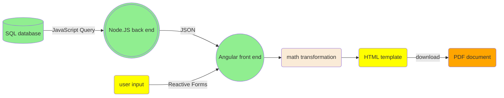

# Print to PDF
This article is about printing to PDF on the front end. You can also create PDF documents on the back end. Each method has its pros and cons. To learn more about creating PDF on the back end, visit /back-end/pdf-generator.



## 1. Why print to PDF using a browser?
- Streamlined workflow. A browser handles everything. A user doesn't need to navigate to vendor app for PDF production.
- Convenient data binding. Angular's two-way data binding is a killer feature. It allows app data to be inserted into a PDF template efficiently. In comparison, injecting data using XML into a Word template requires more programming effort.
- Efficient styling. Unlike a Word document, web pages can share and reuse stylesheets.
- Cost saving. No software licensing fee or consulting fee to build templates.

In summary, using a browser to produce PDF documents is more efficient, offers improved user experience and dramatically reduces production and maintenance cost.

## 2. How to print to PDF in an Angular project?

3. Import HttpClient class into your component and consume it in your constructor
```typescript
import { HttpClient } from '@angular/common/http';
...
constructor(
	private http: HttpClient
) { }
```
4. Compile your .scss stylesheet into .css
	1. If you haven't done so, install sass. 
	<pre class="command-line"><code>npm i -g sass</code></pre>
	2. Compile your .scss into .css
	<pre class="command-line"><code>sass --watch INPUT.scss OUTPUT.css</code></pre>
	(with --watch flag, any source file changes will trigger recompilation upon saving) <br><br>
  
	When deploying your app, you should create an npm command "build" in your package.json file to perform both .scss compilation and ng build. This command can be called in your dockerfile, too.
	```json
	{
		"scripts": {
			"build": "sass SOURCE.scss TARGET.css && ng build --output-path='../server/dist'"
		}
	}
	```

5. Read stylesheet into a string and save it to a class property 'cssStr' in OnInit lifecycle hook
```typescript
  ngOnInit(): void {
    this.http.get('../../../../assets/styles/COMPILED.css', {responseType: 'text'}).subscribe(
      v => { this.cssStr = v }
    );
  }
```
6. In your template, identify the area you want to print.
```html
<div id="pdfContent">
	...
</div>
```
7. In your component, create a function (consumed by 'print to PDF' button in your template) to print to PDF
	- push your stylesheet to header
	- push your content to body
```typescript
printPDF(): void {
	const pdfContent: HTMLElement = document.getElementById('pdfContent');
	const printWindow = window.open('', 'PRINT');
	printWindow.document.write(`<html><head><style>${this.cssStr}</style></head><body>${pdfContent.innerHTML}</body></html>`);
	printWindow.document.close();
	printWindow.focus();
	printWindow.print();
}
```

