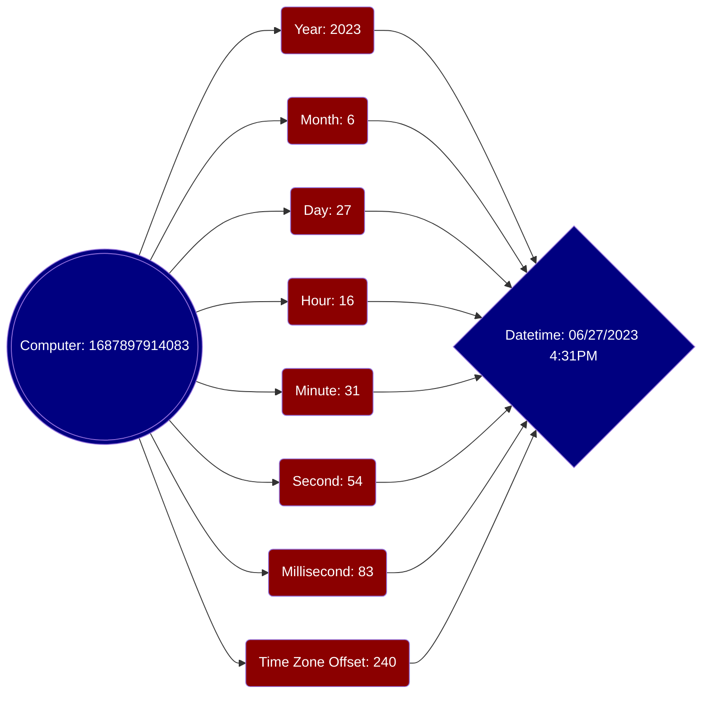

To a computer, a point in time is called a timestamp&mdash;an integer with granularity up to the millisecond. To a human, there are several concepts: 
- year
- month
- day
- hour
- minute
- second
- millisecond
- time zone.  

(There is also daylight saving to make things even more confusing, but let's ignore that.)  
A datetime value with full information (datepart + timepart with time zone offset) maps to a timestamp.   

When a browser displays a datetime value, it will always display it as local time. For example: a 
datetime value in a database is saved as 06/27/2023 @ 12:00AM UTC time 🕛. When it gets displayed in a browser, the value you see depends on your current timezone:
- If you are in Massachusetts, your browser will display 06/26/2023 @ 8:00PM Eastern Time 🕗. 
- If you are in California, your browser will display 06/26/2023 @ 5:00PM Pacific Time 🕔.

When you use our app to save a datetime value to a database, full datepart and timepart with time zone will be saved. When you load the record for display, there'll usually be no problem, as most of our app users are in Eastern Time Zone. 

However, old data from a SQL database (often imported from an Excel workbook) sometimes come without a timepart. It gets converted to a datetime value in a SQL database with the following default rules:
- Time zone is set to UTC (time zone offset is 0)
- Timestamp is set to 12 midnight.

The displayed value of such a converted datetime value will be off by one day 💩, as Eastern Time is behind UTC time by 4 hours. A policy effective date of 08/01/2023 @ 12AM midnight will be displayed as 07/31/2023 @ 8PM 😱.

