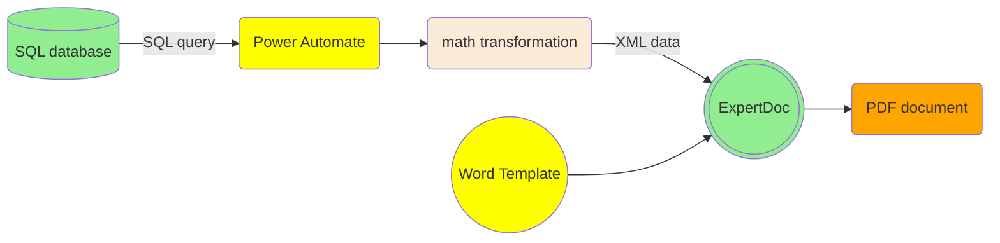
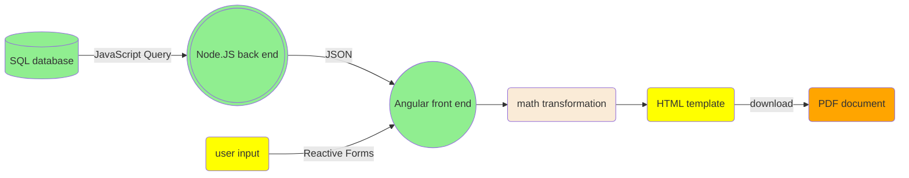
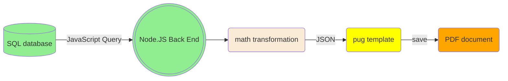
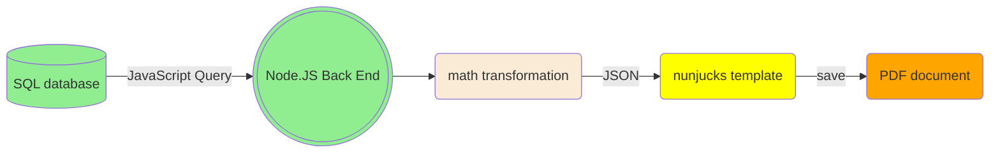

# PDF Document Production: a Comparison of 4 Approaches
This article provides a high level overview of 4 different approaches to creating PDF documents, and why we have landed on LaTeX + nunjucks stack.

## 1. Building PDF docuemnts with proprietary software
PDF documents can be created using Microsoft Word templates using proprietary software. This is by far the most expensive, inefficient approach.

Proprietary software solution: pros and cons
- Pros
	- A Microsoft Word template can be edited without writing code.
- Cons
	- Microsoft Word is not a good templating tool
		- No reusable styles
		- No reusable components
		- Difficult to manipulate programmatically
		- No intra-document reference tracking
	- Complex tech stack using multiple software/technologies with compatibility risks
		- Microsoft Word
		- Power Automate
		- Expert Doc
		- XML
	- Requiring substantially more development effort
		- SQL queries are verbose and not dialect-agnostic (vs. JavaScript + sequelize)
		- XML is verbose (vs. JSON)
		- VBA (for Power Apps) is verbose (vs. JavaScript)
	- Very expensive with high production cost + licensing fee (a template can easily cost more than $100,000)
	___

## 2. Building PDF documents on the front end
Creating PDF documents using  client browser offers a number of advantages, but it comes with its own limitations.

Front end solution: pros and cons
- Pros
	- A user can review an HTML page and make live modifications in a browser before printing to PDF.
	- PDF documents can be created without saving data to a database.
	- PDF document production is delegated to the front end, costing almost nothing on the server side.
- Cons
	- PDF template production is embedded in a complex framework (Angular) and becomes inaccessible to junior developers.
	- Document production as part of a front end Angular app can be affected by changes to the front end app, e.g. a data structure change.
	- With multiple HTML templates, front end can become bloated.
	- A user has to click a button to download a PDF document (due to browser safety, automatic download is not allowed).
	- App has no control over client setup. For example, a user may be using an outdated browser, or accessing the app via a remote desktop.

___
## 3. Building PDF documents on the back end using HTML + pug stack
Creating PDF documents on the back end using a browser API is similar to solution 2, with a few additional advantages.

Back end HTML solution: pros and cons
- Pros
	- Multiple PDF documents can be created and saved to a hard drive with a single click.
	- PDF document creation is no longer part of the front end:
  	- Front end becomes less bloated.
  	- PDF generator tool is easy to maintain because it is decoupled from the front end.
		- Multiple apps can share styles and child components, reducing maintenance cost.
		- Changes to front end will no longer impact PDF generation, making PDF generator app more robust than the front end solution.
	- HTML + pug stack is much simpler than Angular, and can be handled by a junior developer.
	- Database and PDF documents are aligned, as PDF documents can only be created from data saved in a database.
	- Metadata can be saved to a database together with a PDF document.
		- User ID
		- Server time
		- Information about the document such as policy ID, customer ID, type of document, etc
- Cons
	- Live view becomes more expensive because files have to be served by a server.
	- A browser needs to be instantiated to create PDF documents, which can be expensive on the server side, as many users may create PDF documents at the same time.

___
## 4. Building PDF documents on the back end using LaTeX + nunjucks stack
Creating PDF documents on the back end using LaTeX is similar to solution 3 with additional advantages.

Back end LaTeX solution: pros and cons
- Pros
  - A lightweight solution without the need for a browser.
  - LaTeX is built natively for PDF document production with efficient templating.
  - Comprehensive ecosystem with a wide array of packages and templates (book, article, etc.).
  - Intra-document reference tracking greatly reduces template maintenance cost.
- Cons
	- Skills required for building LaTeX templates differ from HTML/CSS/JavaScript stack, which are fundamental skills possessed by all web developers

