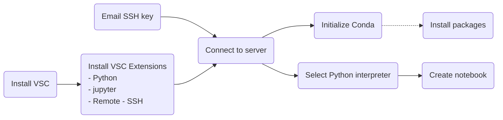

## Connect to a Linux server 🐧 from a Windows client 💻 using Visual Studio Code

For all the instructions below, please replace my LAN ID rxw509 with your own LAN ID.

1. Email your public ssh key file 🔑 to [Margo Stepka](mailto:mstepka@hanover.com) :glasses
   - If you have used .ssh before on this computer, the file can be located at C:\\Users\\<mark>rxw509</mark>\\.ssh\\id_rsa.pub
   - If you don't see a .ssh directory under your LAN ID directory:
     1. launch a Command Prompt (Search for Command Prompt in your Windows search box&mdash;the magnifying glass icon on lower-left corner. The icon for Command Prompt app is a black window.)
     2. Launch the app and you should already be under your personal directory C:\Users\\<mark>rxw509</mark>\\
     3. create a new directory .ssh
		<pre><code class="command-line">mkdir .ssh</code></pre>
     4. Enter the new .ssh directory
		<pre><code class="command-line">cd .ssh</code></pre>
     5. Create your SSH key pair using the command below
		<pre><code class="command-line">ssh-keygen -t rsa -b 2048</code></pre>
     6. Now email Margo your id_rsa.pub file. You may need to unhide hidden directories in your Windows Explorer.
2. Install [Visual Studio Code](https://code.visualstudio.com/download) and extensions on your Windows computer.
   1. Download Windows user installer for x64 CPU architecture and install it on your laptop. We do not have administrative access on our laptops, so you need to install it under your personal directory (which should be the default).
   2. Launch Visual Studio Code and install the following 3 extensions. The installation may take a couple minutes. (You may also uncheck the Welcome Screen at the bottom of the Welcome Screen so next time you launch VSC, you won't be greeted by the same screen):
   	- Remote - SSH
   	- Python 🐍
   	- jupyter 🪐
3. Connect to Azure Linux Virtual Machine.
   1. Create your SSH configuration file.
      1. Click a double-arrow icon on the lower-left corner of VSC (it displays 'Open a Remote Window' on mouseover) &rarr; Connect to Host... &rarr; Configure SSH Hosts... &rarr; Choose C:\\Users\\<mark>rxw509</mark>\\.ssh\\config 
      2. paste the following text into the cofiguration file:
	<pre>
		Host AI_Academy
			HostName 10.93.3.54
			User <mark>rxw509</mark>
			IdentityFile C:\Users\<mark>rxw509</mark>\.ssh\id_rsa
	</pre>
      3. Press Ctrl + s ⌨️ to save the configuration file.
   2. Connect to Azure Linux Virtual MachineNow.
      1. Click on the same double-arrow icon again &rarr; Connect to Host... &rarr; AI_Academy
      2. Connection may take a couple minuites
      3. If you encounter an SSH error, please reach out to Margo so she can check your ssh key.
4. Initialize your personal conda environment on the virtual machine
   1. Press Ctrl + ~ ⌨️ to launch Linux terminal (Ctrl + ~ ⌨️ again to dismiss terminal).
   2. Initialize your conda environment
		<pre><code class="command-line">conda init</code></pre>
   3. Exit the terminal using the <code class="command-line">exit</code> command (or trash can icon on the right) and relaunch terminal using Ctrl + ~ ⌨️. 
   4. Now you should see the word <mark>(base)</mark> prefixed to your terminal prompt. 
   5. (Optional) You can now use conda (a Python package manager that ensures that installed packages are compatible) to install packages whenever need arises. 
   6. Remember that we all share the same Python environment called 'base'. If you are in doubt, leave package installation to the pros (data scientists).
5. Use Python.
   1. Select Python interpreter by pressing Ctrl + Shift + p ⌨️ (hold down Ctrl ⌨️ and Shift ⌨️, and then press p ⌨️ once and release all 3 keys), and type 'Python: Select Interpreter'. Choose the base conda environment.
   2. Create a directory 'Python' under your personal directory, cd into it and create a blank notebook (You can use File Explorer on the upper-left to accomplish the same, but using terminal commands is a lot faster.):
	<pre><code class="command-line">mkdir Python</code></pre>
   <pre><code class="command-line">cd Python</code></pre>
   <pre><code class="command-line">touch test1.ipynb</code></pre>
   3. Now you can use VSC for Python work.
      1. Use File Explorer (upper-left of VSC under <mark>File</mark>) to open the Python directory you just created.
      2. Double-click on the notebook you just created.
      3. It will ask whether to trust the source. Select trust. 
      4. Then it will prompt you to install ipykernel package. This may take a while.
      5. Once it is done, you should be able to use Jupyter Notebook for Python coding.
      6. A few basic tips on Jupyter Notebook. (If you need help, reach out to the data scientists [👩](mailto:jdoyle@hanover.com) [👧](mailto:lscott@hanover.com) [👦](mailto:gmack@hanover.com)):
         - Move your mouse below a cell (middle part). Two buttons will appear for you to create a new code cell (for Python code) or markdown cell (for Markdown documentation)
         - Click on a cell and a menu should appear on the upper right of the cell. There should be a trash can icon for deleting the cell.
         - Type some code and press Ctrl + Enter ⌨️ to execute them.
         - Use Esc ⌨️ to exit edit mode from a cell.
         - Use Ctrl + s ⌨️ to save your file.

