# Remote Desktop Connection from Windows to Linux VM

Operations such as file download, extraction and copy/move can all be accomplished on a terminal. Connecting to a server using Remote Desktop Protocol (RDP) is optional. The Graphical User Interface (GUI) is convenient for people unfamiliar with Linux terminal.

```mermaid
flowchart LR
classDef win fill: darkgreen, color: white
classDef lin fill: navy, color: white
Windows(Windows laptop):::win --> |SSH| Linux("🐧 Linux server"):::lin
Windows --> |RDP| Linux

```

## 1. Software

- You should already have Remote Desktop Connection installed on your Windows computer.
- Gnome Desktop Environment is already installed on the Linux server.
- XRDP, the Remote Desktop Server, is already installed on the Linux server, and the service should be running.

## 2. Connecting to Linux server via RDP (Remote Desktop Protocol)

1. Launch Remote Desktop Connection from your Windows computer.
2. Enter server IP address 10.93.3.54 (AI Academy Linux server).
3. (Optional) Click on 'Show Options' to configure your remote desktop session. For example:
   - Use all monitors
   - Configure display size
4. Click on 'Connect'
   - Make sure the session is 'Xorg'
   - Change your user name from 'HANOVER\xxxxxx' to just your LAN ID 'xxxxxx'
5. Enter your password. If you do not know what it is, or forgot your password, please reach out to one of the administrators (Margo, Jackie, Rui).
	- You can launch Visual Studio Code to connect to the Linux server via SSH, then press Ctrl + ~ to launch a terminal, and use command *passwd* to change your password.
	- Alternatively, reach out to a server administrator (Margo, Jackie) who will be able to create/change password for you.
6. Now you should be able to see the Gnome Desktop Environment.
   1. Press Win + A to bring up Applications
   2. Search for Chrome in the search bar at the top.
   3. Launch Chrome, navigate to AI Academy, log in and download your class bundle (.zip file)
   4. Search for Files and launch File Explorer.
   5. Click into 'Downloads' directory, double click on the downloaded class bundle and extra its contents to your class directory (For example, I use /rxw509/Python/AI_Academy/week10).
   6. Now you should be able to access all files via Visual Studio Code on the Linux server. You may close the remote desktop session.

If you run into troubles, please feel free to reach out to Margo, Jackie or Rui.

