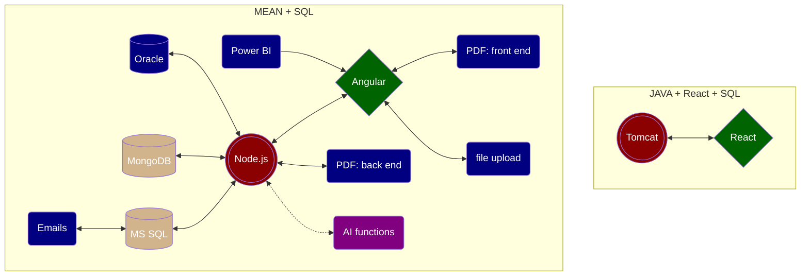

## Addtional features and functionalities

- Oracle database access with Node.js back end (James Wolverson)
- File upload and download (Rui Wang)
- PDF document production 
  - Front end solution (Ryan D'entremont; Kelsey Rustin)
  - Back end solution (Lindsey Fletcher; Sarah Tran)
- Email with Power Apps (Jake Price)
- Apache Tomcat/Spring Boot (Ryan D'entremont; Kelsey Rustin)
- AI enabled software

