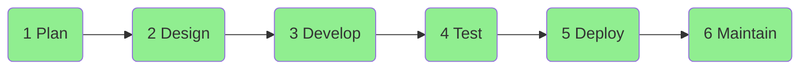
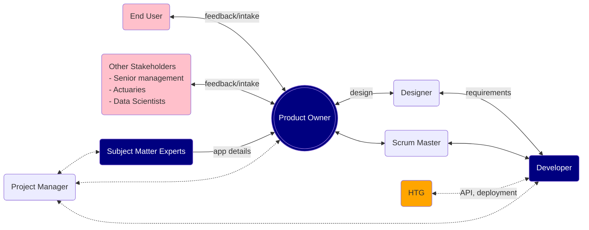

## 1. Six stages of SDLC

___

---

1. **Planning and Analysis**: Identify the current problems & key stakeholders; define project scope and requirements. This step should involve the product owner (a subject matter expert), end users and other stakeholders (senior management, data scientists, actuaries).

2. **Design**: 
- A designer (from the Analytics Consulting team) works with the product owner to create programming requirements, which usually include:
	- UI mockup (e.g. a sequence of screens)
	- Data flow model (what data need to be saved to database or loaded from database; what data need to be acquired via API calls or served via API calls)
	- Business logics (e.g. mathematical calculation, UI interaction rules, input field validation rules)
- A developer (from the Solutions team) provides technical consultation during software design so product owner can make informed decisions (e.g. programming cost of implementing a certain functionality).
- A designer sends requirements to a developer <mark>only after design has been finalized</mark>. Changes to requirements will cause wasted programming effort. Ensure that
	- Agreement has been reached by end users
	- Stakeholders have been consulted
	- Information is complete (e.g. actuaries have finalized rate calculation rules)
	
- Programming requirements need to be <mark>specific and ready to be translated into code</mark>. Avoid vague languages.

3. **Development**:
- The developer should create an early prototype for stakeholders to review and to provide feedback on.
- The developer should meet with product owner regularly to demo software features and to collect feedbacks.
- If additional features (non-trivial) or major changes are needed, the product owner should engage the designer, who should then create and provide updated requirements to the developer. <mark>Project timeline should be adjusted accordingly as requirements change</mark>.

4. **Testing**:
- Developer and end users should always test an app before release to production to ensure that the software is working as intended. 
- Bugs need to be fixed as soon as possible.
- Proposed additional features need to wait for the next release cycle (3-months) to avoid delay to deployment.

5. **Deployment**:
- Development deployment + at least 1 week for testing by product owner or other key stakeholders.
- UAT (user acceptance test) deployment + at least 1 week for testing by a select few end users.
- Production deployment for all end users.

6. **Operations and Maintenance**:
- Developers is responsible for bug fixes.
- Product owner is responsible for training and non-technical support.
- Unless absolutely necessary, <mark>additional feature requests should follow a standard 3-month release cycle</mark>. This helps avoid frequent design changes and frees up a develper for other projects.
