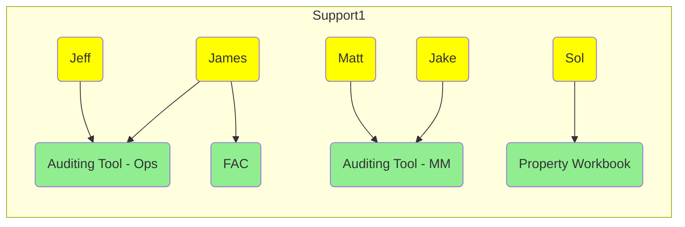
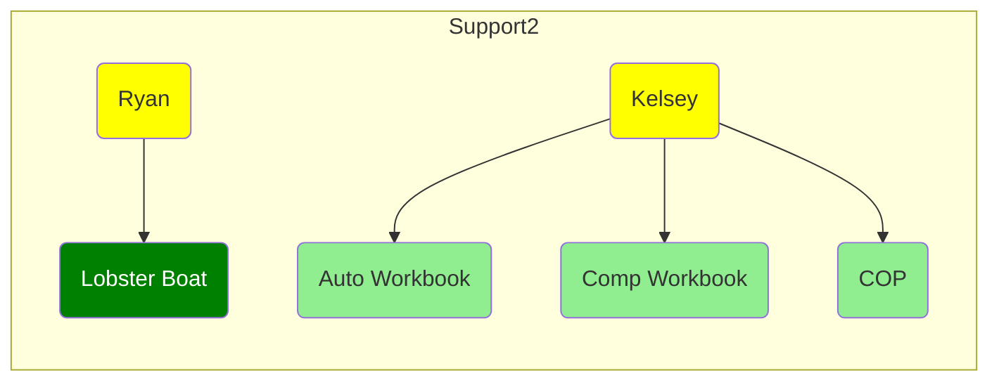
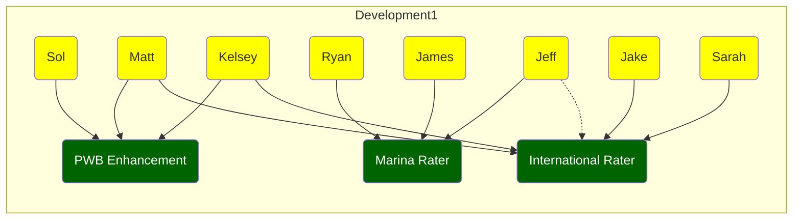
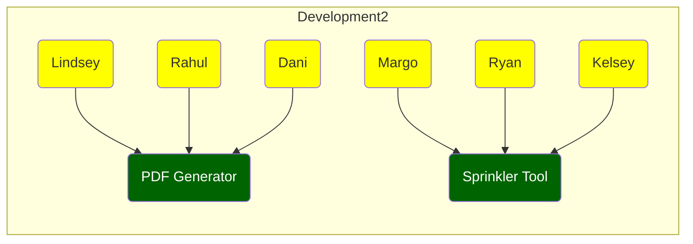

# 1. The Solutions Team

## 1. Our tech stack
<a class="link" href="https://hanover2.sharepoint.com/:v:/t/Enterprise_Data_and_Analytics_Solutions/EYvjfZzs1eFHgSyi3cr7XkUBmMIuKL8tIeVsUuaGxl5_Ow?e=Tu2wXm">2003 Hanover Innovation Expo Video</a>

___

## 2. Projects

___

## 3. Team

<table>
	<thead>
		<th>Team member</th>
		<th>Prject</th>
		<th>Function</th>
	</thead>
	<tr>
		<td>Rui</td>
		<td>all</td>
		<td>management, development</td>
	</tr>
	<tr>
		<td>Margo</td>
		<td>all</td>
		<td>infrastructure support</td>
	</tr>
	<tr>
		<td class="navy">Lindsey</td>
		<td rowspan=3>PDF generator</td>
		<td rowspan=3>development</td>
	</tr>
	<tr>
		<td class="navy">Rahul</td>
	</tr>
	<tr>
		<td class="navy">Dani</td>
	</tr>
	<tr>
		<td>Jake</td>
		<td>International Rater</td>
		<td>management, development</td>
	</tr>
	<tr>
		<td>Ryan</td>
		<td>Marina, Sprinkler</td>
		<td>management, development</td>
	</tr>
	<tr>
		<td>Kelsey</td>
		<td>Sprinkler, International Rater, PACE enhancement</td>
		<td>management, development</td>
	</tr>
	<tr>
		<td>James</td>
		<td>Marina</td>
		<td rowspan=2>development</td>
	</tr>
	<tr>
		<td>Jeff</td>
		<td>Marina, International Rater</td>
	</tr>
	<tr>
		<td>Matt</td>
		<td rowspan=2>International Rater, PACE enhancement</td>
		<td rowspan=2>development</td>
	</tr>
	<tr>
		<td >Sarah</td>
	</tr>
	<tr>
		<td>Solomon</td>
		<td>Property Workbook & enhancement</td>
		<td>development</td>
	</tr>
</table>

