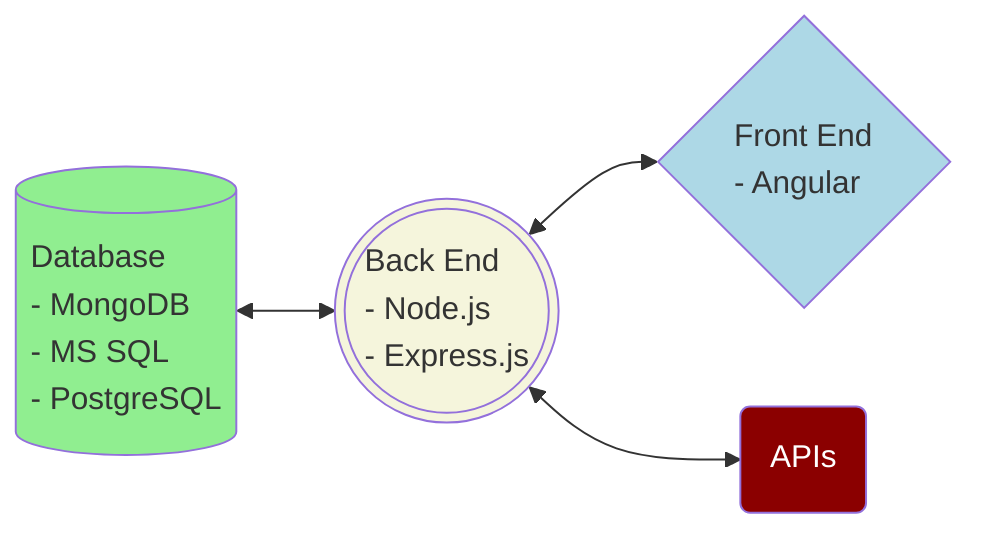

## 1. Angular, Node.js, SQL and MongoDB 

We currently use the following core technologies to build web applications:
- Angular &amp; Material Library (front end)
- Node.js, Express.js (back end)
- MS SQL, PostgreSQL &amp; sequelize (SQL database)
- MongoDB &amp; mongoose (NoSQL database)

---

## 2. How do front end, back end and databases work together?
### 1. Building blocks of a web app
A web application consists of three components:
- Front End
- Back End
- Database 

From the graph above, you can see that the back end serves as the hub of a web app. It talks to the front end and the databases; it also communicates with external APIs (e.g. the back end sends a street address to a vendor's API and receives a flood risk index in return).

---
### 2. The front end
- The front end runs in a browser on a client device (laptop, tablet, cell phone). 
- The front end consists of the following code:
	- HTML (contents of a  web page)
	- CSS (styles, which make the app user-friendly)
	- JavaScript (code driving dynamic behavior, e.g. accepting user inputs in a reactive form)
- The technology stack we currently use to build front end is Angular, an open-source technology from Google. 
	- HTML code live in Angular templates
	- styles are coded in SCSS. SCSS code are translated into CSS code after an Angular project is built. SCSS allows dynamic programming on styles. For example, we can create 50 shades of navy color using functions. In CSS every single color has to be hardcoded.
	- TypeScript (a superset of JavaScript) is used to drive dynamic behavior. TypeScript allows type checking and type annotation, which help prevent bugs and make debugging easier. Like SCSS, TypeScript code are transpiled into JavaScript code for consumption by a browser.

---
### 3. The back end
We use Node.js (a JavaScript runtime, which executes JavaScript outside of a browser) and Express.js (a Node.js package for building web servers) to build the back end. A back end performs the following tasks:
- The back end serves the front end to a client. An Angular front end is compiled into a folder (by convention, the folder name is 'dist') on the back end. When a user types a web app URL in a browser's address bar, the front end is sent from the server to the client browser to be rendered as a web page.
- The back end loads data from and saves data to databases.
- The back end makes API calls to other services so the web app can leverage resources outside of its own domain. 
- A front end can make direct API calls outside of its own domain, but this is often disabled for security reasons. As a result, the back end can serve as a relay point by hosting proxy servers to external APIs.

---
### 4. The databases
We use SQL databases (Microsoft SQL, PostgreSQL, Oracle DB) and MongoDB.
- We use sequelize, a JavaScript library, to perform a lot of database operations (queries) against SQL databases. Compared to raw SQL code, JavaScript code are much shorter, cleaner and easier to maintain.
- We use mongoose, a JavaScript library, to define data structure schemas and data models in a MongoDB database. We use JavaScript to query against a MongoDB database.
- Produciton data (e.g. policy data, claim data) are saved in SQL databases, as data engineers are not yet familiar with MongoDB queries. App meta data such as rating lookup tables are saved in a MongoDB database for easy consumption.
