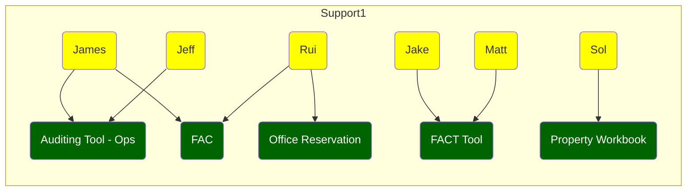
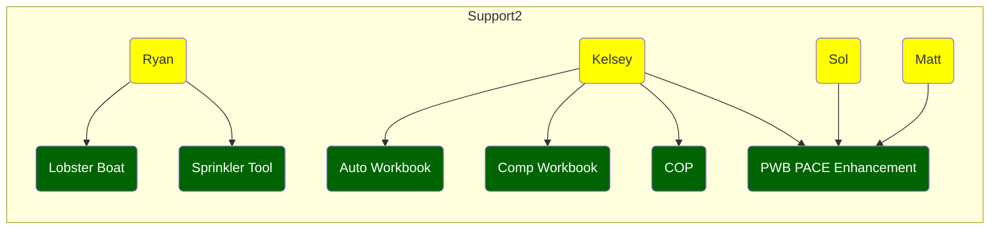
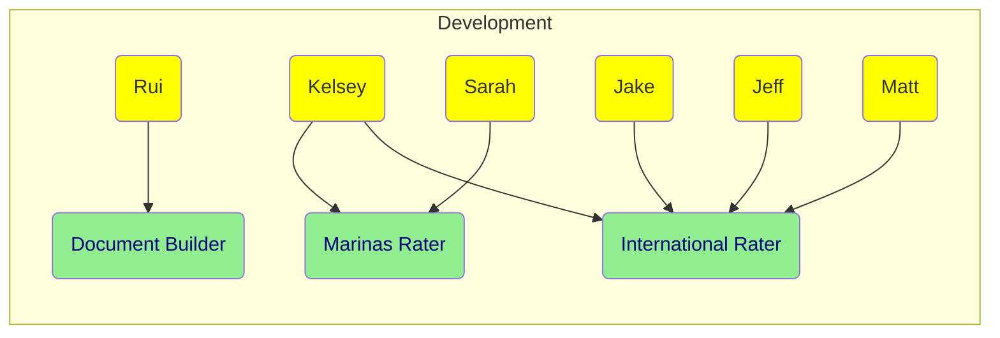

# Projects

1. Property Workbook
2. Workers Compensation Workbook
3. Commercial Auto Workbook
4. Auditing Tool for Operations
5. FACT (File Analysis and Coaching Tool)
6. FAC (Facultative Reinsurance Spreaders)
7. COP (Commercial Output Policies)
8. Lobster Boat Rater
9. Sprinkler Tool
10. Marinas Rater
11. International Rating Platform
12. Office Reservation App
13. Document Builder
14. Marine RAPP

