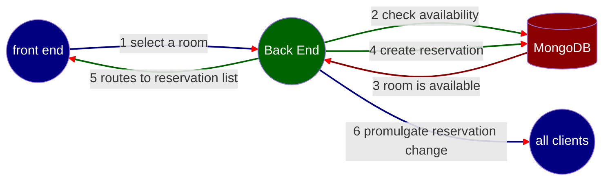

# Mermaid for charting

A picture tells a thousand words. Here is an example:

1. User selects an available room on the front end, which then sends time interval(s) and room number to the back end.
2. The back end execute a query against the MongoDB database to make sure that the room is available.
3. Database query confirms that the room is available and informs the back end.
4. The back end inserts new reservation(s) to the MongoDB database.
5. The front end routes to reservation list
6. The change is promulgated to all clients. If a client is on the the reservation inquiry page, the list of available rooms will update in real time.
  

Markdown code

<pre><code>

</code></pre>