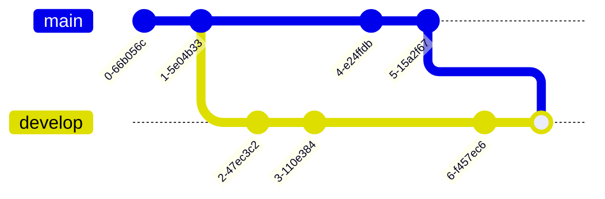

# Git
- clone an existing repository
<pre class="command-line"><code>git clone xxxx</code></pre>
- add a remote repo (origin)
<pre class="command-line"><code>git remote add origin xxxx</code></pre>
- remove a remote repo (origin)
<pre class="command-line"><code>git remote rm origin xxxx</code></pre>
- push to a remote git repo (origin) branch (master)
<pre class="command-line"><code>git push -u origin master</code></pre>
- pull from and push to a remote repo's branch (of the same name as your local branch)
<pre class="command-line"><code>git pull</code></pre>
<pre class="command-line"><code>git push</code></pre>
- git repo initialization
<pre class="command-line"><code>git init</code></pre>
- stage all files and commit with a message
<pre class="command-line"><code>git add . && git commit -m 'xxxx'</code></pre>
- reset to HEAD (or another commit) and remove files not under version control and files ignored by git 
<pre class="command-line"><code>git reset HEAD --hard && git clean -fdx</code></pre>
- check out a new branch
<pre class="command-line"><code>git checkout -b XXXX</code></pre>
- merge master branch with a branch
<pre class="command-line"><code>git checkout master && git merge XXXX</code></pre>
- delete a local branch (-d for a merged branch; -D for an unmerged branch, where branch data will be lost)
<pre class="command-line"><code>git branch -d XXXX</code></pre>
- rebase a branch off master branch 

git rebase is a bit more complex. You are working on branch XXXX, and someone else pushed to master branch. You check out XXXX and rebase XXXX branch to the new master branch, so that code pushed by the other dude is now incorporated into your XXXX branch. 
After rebase, commits 2, 3 and 6 will reflect changes effected by commits 4 and 5. Since <mark>git rebase rewrites commit history, you should use it with caution and rebase only your personal branch</mark>.
<pre class="command-line"><code>git checkout XXXX && git rebase master</code></pre>

